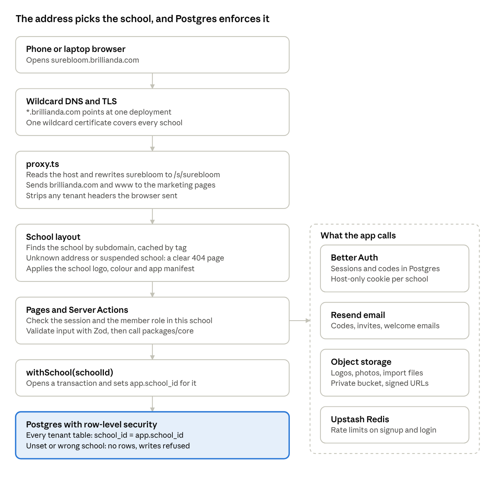
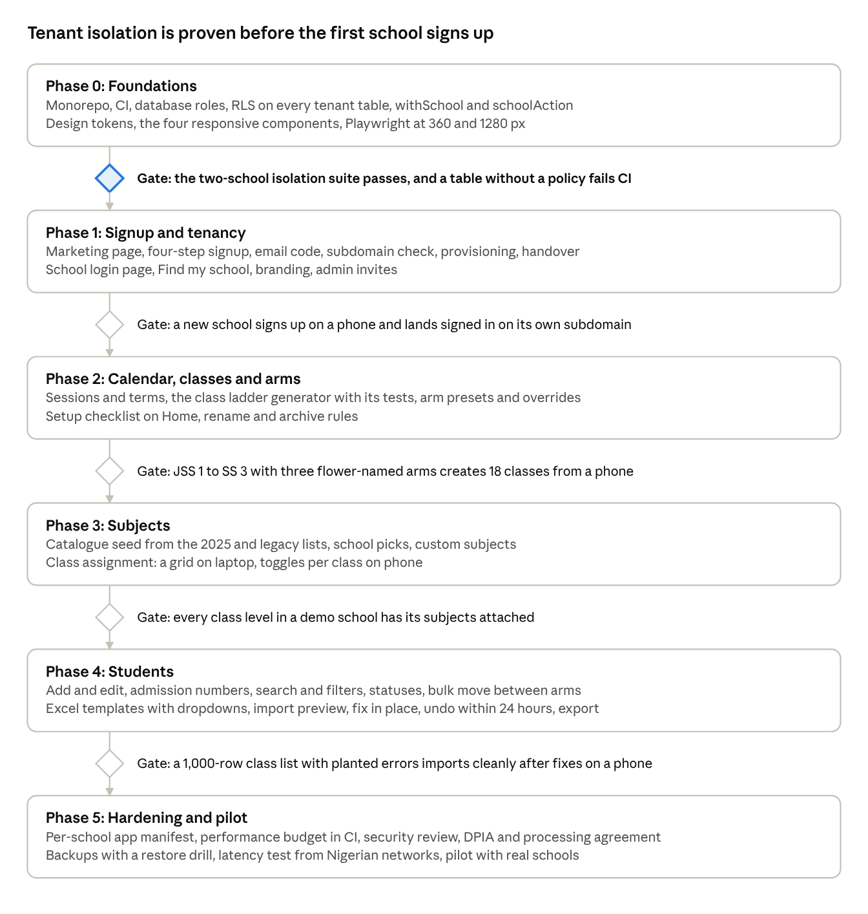

# Brillianda: school management system plan

Oct 6, 2026 · @Tochi

## What Brillianda is

Brillianda v1 is a self-serve school registry. A school signs up at brillianda.com and claims an address like surebloom.brillianda.com. From there it manages classes, arms, subjects and students, on a phone as easily as on a laptop.

Every school's data sits in one shared system, walled off per school. The LMS and CBT modules from the April spec come after this core and build on it. The Brillianda platform admin console is a separate piece of work.

### Who uses v1

| Person                      | What they do in v1                                                                      |
|-----------------------------|-----------------------------------------------------------------------------------------|
| School owner (proprietor)   | Creates the school, holds the primary email, sets everything up, invites admins         |
| School admin                | Runs setup and student records day to day; cannot delete the school or change ownership |
| Teachers, parents, students | No login in v1. Student and guardian records exist so later modules can attach to them  |

### The journey

1.  A proprietor opens brillianda.com and taps Create your school.

2.  They enter the school's details, then create the owner account with their email.

3.  They confirm the email with a 6-digit code and pick a subdomain.

4.  Brillianda creates the school and signs them in at surebloom.brillianda.com.

5.  A setup checklist walks them through the calendar, classes, arms and subjects.

6.  They add students one by one or upload class lists from a template.

7.  After setup, the daily work is finding students, editing records and moving them between arms, mostly on a phone.

### What v1 includes

| In v1                                            | After v1                                       |
|--------------------------------------------------|------------------------------------------------|
| Self-serve signup, subdomain and school branding | Brillianda platform admin console              |
| Owner and admin accounts, admin invites          | Teacher, parent and student logins             |
| Sessions and terms                               | Attendance                                     |
| Class levels and arms with quick setup           | Results, report cards and broadsheets          |
| Subject catalogue and class assignment           | Fees with Paystack                             |
| Students: add, import, edit, move, statuses      | LMS and CBT                                    |
| Installable app per school                       | Custom domains such as portal.surebloom.edu.ng |
| Audit log of changes                             | SMS and WhatsApp notices                       |

### How I read two parts of the brief

- "From when did your school start": I take this as "which class does the school start from, and which does it end at". A secondary school picks JSS 1 to SS 3 and gets every class in between. If you meant the year the school opened, that becomes a profile field and setup works the same way.

- "A dedicated frontend deployed for them": each school gets its own address, logo, colours, login page and home-screen icon. One deployment serves all of them, so a fix reaches every school at once instead of being rebuilt per school. The architecture section explains how.

## Creating a school

Signup is four short screens and ends with the owner signed in on the new subdomain. Nothing is built or deployed per school, so the address works the moment the school's record exists.

### The four screens

| Step | Screen         | What it asks                                                                   | Notes                                                                                            |
|------|----------------|--------------------------------------------------------------------------------|--------------------------------------------------------------------------------------------------|
| 1    | School details | School name, levels offered (Nursery, Primary, Secondary), state, school phone | The name pre-fills the subdomain suggestion. Levels offered set the default class range in setup |
| 2    | Owner account  | Full name, email, password, phone (optional)                                   | This email becomes the school's primary email. The bot check runs here                           |
| 3    | Verify email   | 6-digit code                                                                   | The code expires in 10 minutes; resend unlocks after 60 seconds                                  |
| 4    | School address | Subdomain, shown with .brillianda.com after it                                 | Checked as they type, with suggestions when a name is taken                                      |

Each step saves as it goes, so a dropped connection or a closed tab resumes where it stopped.

### The primary email

- Each school has one owner, and the owner's verified email is the primary email. Billing, security and ownership notices go there.

- Changing it needs the current password and a code sent to the new address.

- The same email can own or work in more than one school, which suits proprietors with two campuses. Login shows a school picker for those people.

- Ownership can move to another admin later, and both people get an email when it does.

### Subdomain rules

- 3 to 30 characters: lowercase letters, digits and single hyphens. It starts with a letter and never ends with a hyphen.

- Suggestions come from the school name: "Surebloom School" suggests surebloom, surebloomschool and surebloom-school.

- A reserved list blocks names the platform needs (www, app, api, admin, auth, mail, status, help, docs, blog, cdn, staging) and names that impersonate exam bodies or agencies (waec, neco, jamb, ubec).

- Uniqueness is case-insensitive and enforced by a unique index, so two people racing for one name cannot both get it.

- The availability check is debounced and rate limited, and it says why a name is unavailable: taken, reserved or invalid.

- After v1, a school can rename its subdomain once, with the old address redirecting for 90 days.

### What happens on Create

One database transaction does the provisioning:

1.  Create the school with status active.

2.  Make the signer its owner.

3.  Create the current session and term from today's date. A school signing up in October 2026 starts on 2026/2027, First Term, and can change it in setup.

4.  Set defaults: admission number format, three terms per session, brand colour.

5.  Write the first audit log entry.

After the commit, Brillianda sends a welcome email with the new address and hands the owner over to it. The marketing site and the school's subdomain do not share a login cookie, so the handover uses a one-time token that lives for 60 seconds. The subdomain exchanges it for its own session.

### Signing in later

- Owners and admins sign in at their school's address, on a login page that shows the school's logo and name.

- brillianda.com/login has a Find my school form. It emails the person links to each of their schools, and the page never reveals whether an email has an account.

- Password reset and optional email magic links work from the school's own login page.

## Quick setup: calendar, classes and arms

Two answers produce the whole class list: the class the school starts and ends at, and the number of arms per class. A secondary school answering "JSS 1 to SS 3, three arms" gets 18 classes in one step.

### The setup checklist

After signup, Home shows a checklist the owner can work through in any order and leave halfway:

1.  Academic calendar

2.  Classes

3.  Arms

4.  Subjects

5.  Students

6.  Invite an admin (optional)

### Academic calendar

- The session defaults from today's date, with a new session starting in September.

- Three terms by default: First (September to December), Second (January to April), Third (May to July), as in Lagos State's 2026/2027 calendar. Owners adjust the dates to their own calendar.

- British-curriculum schools often say Autumn, Spring and Summer, so term names are editable and a session can have two or three terms.

### The class ladder

Brillianda keeps one ordered ladder of class levels. The owner picks a start and an end, and every level in between is created in order.

| Section          | Default names                                        | Other naming schemes offered            |
|------------------|------------------------------------------------------|-----------------------------------------|
| Pre-school       | Creche, Pre-Nursery, Nursery 1, Nursery 2, Nursery 3 | Playgroup, KG 1, KG 2, Reception        |
| Primary          | Primary 1 to Primary 6                               | Basic 1 to 6, Year 1 to 6, Grade 1 to 6 |
| Junior secondary | JSS 1 to JSS 3                                       | Basic 7 to 9, Year 7 to 9, Grade 7 to 9 |
| Senior secondary | SS 1 to SS 3                                         | Year 10 to 12, Grade 10 to 12           |

The screen works like this:

- Two pickers: Our first class and Our last class. Defaults come from the levels ticked at signup: Secondary gives JSS 1 to SS 3, Primary gives Nursery 1 to Primary 6, both gives Nursery 1 to SS 3.

- A naming scheme switch (Nigerian, Basic, British, American) updates the preview as it changes.

- The preview lists every class with inline rename, remove (a school without Nursery 3 drops it) and Add a class (for Year 13 or a Pre-JSS class).

- Confirm creates the levels with their order, so promotion later knows JSS 3 leads to SS 1.

Each class level stores a display name, a short name (JSS1), its section, its position on the ladder and aliases for import matching (JSS1, JS1, Jss 1, Year 7).

### Arms

- "How many arms does each class have?" is a stepper from 1 to 10. One arm shows as plain "JSS 1", though the database still holds one arm so every student always sits in an arm.

- Arm names come from a preset or the school's own list and apply in order to every class.

| Preset   | Names                                 |
|----------|---------------------------------------|
| Letters  | A, B, C, D                            |
| Colours  | Blue, Gold, Green, Red                |
| Flowers  | Anthurium, Begonia, Calla Lily, Daisy |
| Gems     | Diamond, Emerald, Ruby, Sapphire      |
| Your own | Typed as chips, in any order          |

- Classes can differ: JSS 1 might take four arms while SS 3 has two. On a laptop this is a grid of classes against arms; on a phone it is a list of classes with a stepper each.

- Every arm gets a short code for tight screens (Anthurium becomes ANT, editable). A phone chip reads JSS1 ANT while a laptop table reads JSS 1 Anthurium.

- Before confirming, the preview spells out the result: "This creates 18 classes: JSS 1 Anthurium, JSS 1 Begonia, JSS 1 Calla Lily..."

- Senior secondary arms can carry a department (Science, Arts, Commercial) for schools that split SS that way, so subject defaults follow the arm.

### Editing after setup

- Arm names live once per school, so renaming Daisy renames it in every class.

- An arm can be added to a single class at any time.

- An arm or class that has students cannot be deleted. Move the students first, or archive it; archived classes keep their history for past sessions.

The generator is a pure function in the shared core package: ladder, start, end, naming scheme, arm names and overrides go in, the class list comes out. Unit tests cover it, so an agent can change it without breaking setup.

## Subjects

Schools pick subjects from a national catalogue that Brillianda maintains, then attach them to class levels. The catalogue holds the 2025 curriculum and the subjects it replaced, because schools will run both lists side by side for the next few sessions.

### Why both lists

- The Federal Ministry of Education announced a curriculum review in September 2025 with fewer subjects per level, Nigerian History restored as a subject and six trade subjects ([<u>FME press release</u>](https://education.gov.ng/wp-content/uploads/2025/09/FG-OVERHAULS-CURRICULUM-1.pdf)).

- NERDC rolls the new lists out at entry classes (Primary 1, Primary 4, JSS 1 and SS 1) at the start of each three-year cycle, and scheduled the basic curriculum for the 2026/2027 session ([<u>Daily Trust</u>](https://dailytrust.com/revised-national-curriculum-is-apt-but/), [<u>BusinessDay</u>](https://businessday.ng/?p=1171409)).

- WAEC examines 2026 and 2027 candidates with English Language and General Mathematics as the only core subjects, and will not examine Citizenship and Heritage Studies or Digital Technologies until 2028 ([<u>WAEC</u>](https://waecnigeria.org/node/102)).

- In December 2025 the ministry said all subjects remain open to schools ([<u>TheCable</u>](https://www.thecable.ng/?p=1256089)).

A school in 2026/2027 can therefore teach SS 1 from the new list while SS 2 and SS 3 keep Civic Education and Computer Studies. Every catalogue entry is tagged NERDC 2025 or Legacy, and a school can attach either kind to any class.

### The 2025 lists

Names as NERDC publishes them ([<u>NERDC curriculum offerings</u>](https://nerdc.gov.ng/content_manager/Basic%20and%20Senior%20Secondary%20Education%20Curriculum%20Offerings.pdf)). The FME and NERDC give different caps for Primary 4 to 6.

| Level                      | Subjects                                                                                                                                                                                                                                                                                                        | Subjects per student             |
|----------------------------|-----------------------------------------------------------------------------------------------------------------------------------------------------------------------------------------------------------------------------------------------------------------------------------------------------------------|----------------------------------|
| Primary 1 to 3             | English Studies, Mathematics, one Nigerian language, Basic Science, Physical and Health Education, CRS or Islamic Studies, Nigerian History, Social and Citizenship Studies, Cultural and Creative Arts, Arabic (optional)                                                                                      | 9 to 10                          |
| Primary 4 to 6             | The Primary 1 to 3 list with Basic Science and Technology in place of Basic Science, plus Basic Digital Literacy, Pre-vocational Studies and French (optional)                                                                                                                                                  | 10 to 12 (FME), 11 to 13 (NERDC) |
| JSS 1 to 3                 | English Studies, Mathematics, one Nigerian language, Intermediate Science, Physical and Health Education, Digital Technologies, CRS or Islamic Studies, Nigerian History, Social and Citizenship Studies, Cultural and Creative Arts, Business Studies, one trade subject, French (optional), Arabic (optional) | 12 to 14                         |
| SS 1 to 3, core            | English Language, General Mathematics, Citizenship and Heritage Studies, Digital Technologies, one trade subject                                                                                                                                                                                                | 8 to 9 in all, core included     |
| SS Science electives       | Biology, Chemistry, Physics, Agriculture, Further Mathematics, Physical Education, Health Education, Foods and Nutrition, Geography, Technical Drawing                                                                                                                                                          | Chosen toward the 8 to 9         |
| SS Humanities electives    | Nigerian History, Government, CRS, Islamic Studies, one Nigerian language, French, Arabic, Visual Arts, Music, Literature in English, Home Management, Catering Craft                                                                                                                                           | Chosen toward the 8 to 9         |
| SS Business electives      | Accounting, Commerce, Marketing, Economics                                                                                                                                                                                                                                                                      | Chosen toward the 8 to 9         |
| Trade subjects, JSS and SS | Solar PV Installation and Maintenance, Fashion Design and Garment Making, Livestock Farming, Beauty and Cosmetology, Computer Hardware and GSM Repairs, Horticulture and Crop Production                                                                                                                        | One per student                  |

The FME's release limits the Nigerian language to Hausa, Igbo or Yoruba, so the catalogue lists the three as separate subjects.

### Beyond the 2025 lists

- Legacy entries cover subjects older classes still take, such as Civic Education, Social Studies, Basic Technology, Computer Studies, Agricultural Science and earlier trade subjects like Data Processing, Garment Making and GSM Maintenance ([<u>NERDC publications</u>](https://www.nerdc.gov.ng/content_manager/pdf_files/nerdc_publications.pdf)).

- Custom subjects cover what a school teaches outside the catalogue, for example Phonics, Verbal Reasoning or Quantitative Reasoning.

- British- and American-curriculum schools build their list from custom subjects in v1. A Cambridge catalogue can follow if those schools sign up.

### How a school sets subjects

1.  The Subjects step pre-ticks the 2025 list for each section the school runs. The admin unticks what they don't teach and adds optional, legacy or custom subjects.

2.  Each subject gets a short code (ENG, MTH, BIO) for small screens and later result sheets. A school can rename a subject, say English Studies to English, and it stays linked to its catalogue entry.

3.  Brillianda attaches each subject to its default class levels. On a laptop the admin adjusts a grid of class levels against subjects; on a phone they open one class level and toggle its subjects.

4.  Each attachment is compulsory or elective. Senior secondary electives can carry a department, so an SS 1 arm marked Science gets the Science electives by default.

Per-student choices, such as CRS or Islamic Studies and each student's SS electives, arrive with results after v1, since results are the first feature that needs them.

### Keeping the catalogue current

The catalogue is platform data, seeded from a versioned file in packages/db with a source link per entry. When NERDC changes the lists again, a migration adds the new entries and marks the replaced ones Legacy. A school's own choices never change without its admin's action.

## Students

Students are added one at a time or in bulk from a spreadsheet, and each student sits in exactly one class arm per session. The import is the first thing most schools will judge Brillianda on, because their real data arrives through it.

### Adding one student

- Required: first name, last name, gender, class arm. Optional: other names, date of birth, admission number (generated when blank), admission date, guardian, address, state of origin, photo.

- On a phone the form is one column with a sticky Save button. Save and add another keeps the class selected for the next child.

- Siblings share a guardian record. Typing a guardian phone number that already exists offers to link that guardian.

### Admission numbers

- The school sets a format once from a prefix, the year and a running number, for example SBS/2026/0042.

- The number comes from a per-school counter inside the same transaction as the insert, so two admins adding students at the same moment never collide.

- Imported admission numbers are kept as written, and a unique index per school stops duplicates.

### The templates

- A whole-school template has Class and Arm columns. A per-class template, downloaded from a class page, needs neither.

- Templates are Excel files generated for each school. The Class and Arm columns are dropdowns filled with that school's own names, so admins pick instead of typing "JS1" or "Jss one". CSV uploads work too.

| Column           | Required                         | Example                    | Rule                                                              |
|------------------|----------------------------------|----------------------------|-------------------------------------------------------------------|
| First name       | Yes                              | Chiamaka                   | Letters, spaces, hyphens, apostrophes; marks such as Ọ and ṣ kept |
| Last name        | Yes                              | Okafor                     | Same as first name                                                |
| Other names      | No                               | Adaeze                     | Same as first name                                                |
| Gender           | Yes                              | Female                     | Male or Female; M and F accepted                                  |
| Date of birth    | No                               | 14/03/2014                 | Day first; Excel date cells accepted                              |
| Class            | In the whole-school file         | JSS 1                      | Matched to class names and aliases                                |
| Arm              | When the class has more than one | Anthurium                  | Matched to arm names and short codes                              |
| Admission number | No                               | SBS/2026/0042              | Generated when blank                                              |
| Admission date   | No                               | 08/09/2025                 | Day first                                                         |
| Guardian name    | No                               | Ngozi Okafor               | Free text                                                         |
| Guardian phone   | No                               | 0803 000 0001              | Stored as +2348030000001                                          |
| Guardian email   | No                               | ngozi@example.com          | Checked for format only                                           |
| Address          | No                               | 12 Aba Road, Port Harcourt | Free text                                                         |

### How an import runs

1.  The admin uploads a CSV or Excel file of up to 5,000 rows.

2.  The browser parses it, so the preview appears at once even on a slow connection.

3.  Headers map automatically, including common variants such as Surname, Sex and Adm No. A combined value like "JSS 1A" splits into class and arm. The admin confirms the mapping, and Brillianda remembers it for next time.

4.  The server validates every row again, since it never trusts the browser's checks, and shows a preview: ready, needs fixing, possible duplicates.

5.  Errors show per cell with a reason and a suggestion: "Class JS1 not found. Did you mean JSS 1?" Admins fix cells in place (a bottom sheet on a phone) or download only the failed rows, fix them in Excel and upload again.

6.  Commit writes the rows in chunks of 500, tagged with an import batch id. The result screen shows counts and links to the new students.

7.  Undo removes a whole batch within 24 hours, as long as nobody has edited those students since.

### Validation rules

- Duplicates inside the file: the same admission number twice, or the same full name with the same date of birth.

- Duplicates against existing students: a matching admission number offers Update or Skip, and a matching name with the same birth date gets a warning.

- Class and arm matching runs exact, then normalised (case and spaces), then aliases. A near match is only a suggestion and is never applied without a click.

- Dates are read day first. A date like 03/14/2014 that only works month first is flagged instead of guessed.

- Phone numbers are normalised to the +234 format. A bad guardian phone is flagged but does not block the row.

- Names are trimmed and Unicode-normalised, and search ignores accents, so typing Ola finds Ọlá. Capitalisation only changes if the admin asks.

- Exports escape cells that start with =, +, - or @ so a spreadsheet will not run them as formulas.

### Managing students

- The student list searches by name or admission number and filters by class, arm, gender and status.

- Bulk actions: move to another arm, change status, export.

- A student's page shows details, guardians, class history and a change history from the audit log.

- Statuses are active, withdrawn, transferred, graduated and suspended. Real departures change the status so the record survives; delete exists only for mistakes and is a soft delete.

- End-of-session promotion comes after v1. The data model already supports it through per-session enrolments and the order of the class ladder.

## Mobile-first UI

Every screen is designed at 360 px wide first and widened after, because most owners and admins will run their school from an Android phone on mobile data. Laptop layouts add room; they never add features the phone lacks.

### Navigation

- Phone: a bottom tab bar with Home, Students, Classes, Subjects and More. The top bar holds the school logo, search and the account menu.

- Tablet and laptop: a collapsible sidebar with the same items, plus a command palette (Ctrl or Cmd + K) that finds students and jumps to any page.

- Home shows the setup checklist until it is done, then a short summary: student count, classes and recent changes.

### One component, two layouts

| Pattern                   | Phone                                                       | Laptop                                                |
|---------------------------|-------------------------------------------------------------|-------------------------------------------------------|
| Lists (students, classes) | Cards with name, class chip and one action; infinite scroll | Sortable table with row selection and a column picker |
| Create and edit           | Full-height bottom sheet with a sticky Save                 | Side panel or dialog                                  |
| Filters                   | Sheet behind a Filter button that shows the active count    | Inline filter bar                                     |
| Bulk actions              | Select mode, then an action bar at the bottom               | Checkbox column with an action bar on top             |
| Confirmations             | Bottom sheet that states the consequence                    | Dialog                                                |
| Class by subject matrix   | One class at a time with toggles                            | Grid with sticky headers                              |

Each row of this table is one shared component (DataList, ResponsiveDialog, FilterSheet, ActionBar), so no screen invents its own mobile layout.

### Rules every screen follows

- Touch targets of at least 44 × 44 px, and nothing that depends on hover.

- The right keyboard for each field: tel for phones, numeric for counts, email for email, the native picker for dates.

- Inputs at 16 px or larger, which stops iPhones zooming in on focus.

- Every empty list says what to do next: "No students in JSS 1 Anthurium yet. Upload a class list or add a student."

- Small edits apply at once and show an Undo toast.

- Forms keep a local draft, so a dropped connection or an incoming call does not lose typing.

### Performance budget

| Measure (mid-range Android, throttled 4G) | Target                         |
|-------------------------------------------|--------------------------------|
| Largest Contentful Paint                  | Under 2.5 s                    |
| Interaction to Next Paint                 | Under 200 ms                   |
| JavaScript on first dashboard load        | Under 170 KB compressed        |
| Student list of 1,000 rows                | Scrolls smoothly (virtualised) |

Server components do the reading and client code stays in small islands. The app uses one subset font or the system font, and charts wait until after v1. Lighthouse CI fails any build that breaks the budget.

### School branding

- Logo, school name and one brand colour are set during setup. Brillianda works out accessible text colours from the brand colour, so a pale yellow brand never produces unreadable buttons.

- The login page, header and emails carry the school's identity. Brillianda shows only as a small Powered by Brillianda link.

- Each subdomain serves its own web app manifest with the school's name and logo. Add to Home Screen then gives an icon called Surebloom School, which is as close to a dedicated app per school as v1 needs.

- v1 caches the app shell and shows a clear offline banner. Full offline data entry waits for a later release.

### Accessibility and testing

- WCAG 2.2 AA: contrast, labelled fields, visible focus, names on icon buttons, reduced motion respected.

- Playwright runs every main flow at 360 × 800 and 1280 × 800 on each pull request.

- Someone on the team uses a low-end Android phone for a real session every week. Emulators hide what a cheap phone on a weak network shows.

## Architecture

One Next.js app serves brillianda.com and every school subdomain, and one Postgres database holds every school's rows, kept apart by row-level security. The app works out the school from the address on each request and never accepts a school id from the browser.

request path · seven steps from browser to Postgres, four services alongside

A request to surebloom.brillianda.com passes down the left column in order. Pages and Server Actions call the services on the right.

### Stack

| Layer           | Choice                                                                                             | Reason                                                                                                                                                                        |
|-----------------|----------------------------------------------------------------------------------------------------|-------------------------------------------------------------------------------------------------------------------------------------------------------------------------------|
| App             | Next.js 16 App Router (16.3.8 or later), TypeScript, React 19                                      | One app for the marketing site and every school. proxy.ts, the renamed middleware, routes subdomains on the Node.js runtime                                                   |
| UI              | shadcn/ui on Tailwind CSS v4, lucide icons                                                         | The components live in the repo, so the responsive patterns are Brillianda's own                                                                                              |
| Forms           | React Hook Form with Zod 4                                                                         | One schema validates in the browser and again on the server                                                                                                                   |
| Tables          | TanStack Table                                                                                     | Sorting, selection and column choice on laptop screens                                                                                                                        |
| Database        | PostgreSQL with row-level security, pg_trgm and unaccent                                           | Isolation enforced below the app, and accent-insensitive name search                                                                                                          |
| ORM             | Drizzle ORM 0.45                                                                                   | Policies sit in the schema files, and the per-request transaction is plain code                                                                                               |
| Auth            | Better Auth                                                                                        | Passwords, email codes, magic links, rate limits and a Turnstile captcha plugin                                                                                               |
| Email           | Resend with React Email                                                                            | Templates are React components in packages/email                                                                                                                              |
| Spreadsheets    | Papa Parse for CSV, SheetJS 0.20.3 for reading Excel, ExcelJS for writing templates with dropdowns | SheetJS stopped publishing to npm at 0.18.5, so install it from the SheetJS CDN. ExcelJS has not shipped a release since October 2023, so pin it and test the files it writes |
| Phone numbers   | libphonenumber-js                                                                                  | Normalises numbers to +234 format                                                                                                                                             |
| Abuse control   | Upstash Ratelimit, Cloudflare Turnstile                                                            | Limits on signup, login and the subdomain check                                                                                                                               |
| Installable app | Serwist                                                                                            | Service worker and offline banner                                                                                                                                             |
| Repo            | pnpm workspaces with Turborepo                                                                     | Cached builds and tests per package                                                                                                                                           |
| Tests           | Vitest for packages, Playwright for flows                                                          | Flows run at 360 and 1280 px                                                                                                                                                  |

### Decisions and why

- One deployment serves every school. The logo, colours, login page and home-screen icon change per school at request time, so nothing is built or deployed when a school signs up.

- The school comes from the host. proxy.ts reads the host, strips any x-tenant headers the browser sent, and rewrites surebloom.brillianda.com/students to /s/surebloom/students. A direct request for a /s/ path returns 404, so a school's pages open only at its own address.

- Every mutation goes through schoolAction(). The wrapper resolves the school from the request, loads the session, checks membership and role, validates input with Zod, applies a rate limit, runs the work inside withSchool() and writes the audit entry. An ESLint rule stops feature code from importing the database client directly.

- v1 has no separate API service. Server Components read, Server Actions write, and route handlers cover uploads, webhooks and the subdomain check. The logic sits in packages/core, so a NestJS API for a future mobile app can reuse it.

- Better Auth handles identity: users, sessions, passwords, email codes and magic links. Roles per school live in Brillianda's own school_members table, next to the tables its policies protect. The organization plugin could hold them instead, but it keeps its own tables and caps each organisation at 100 members by default ([<u>Better Auth organizations</u>](https://www.better-auth.com/docs/plugins/organization)).

- Session cookies stay host-only, which is Better Auth's default, so a session made on surebloom.brillianda.com is never sent to another school. Cross-subdomain cookies stay off, and signup hands over to the subdomain with the one-time token described earlier.

- Better Auth's built-in rate limiter ignores server-side auth.api calls, so Server Actions that make them use Upstash limits ([<u>Better Auth rate limits</u>](https://www.better-auth.com/docs/concepts/rate-limit)).

- The school lookup by subdomain is cached under a tag and revalidated when settings change. Student data is never cached between requests.

- Vercel preview deployments have no school subdomains, because per-tenant preview URLs are an Enterprise feature. In preview builds only, proxy.ts accepts ?school=surebloom.

- Local development runs at surebloom.localhost:3000, which Chrome resolves without hosts-file changes.

### Hosting

Keep the app and the database in one region, and start in London. WonderNetwork's pings from Lagos average about 104 ms to London, 123 ms to Frankfurt and 240 ms to Cape Town ([<u>WonderNetwork</u>](https://wondernetwork.com/pings/Lagos)). Those figures come from one server pair per city, so time requests from MTN, Airtel and Glo lines in Lagos and Port Harcourt before launch.

|                      | Vercel with managed Postgres (recommended for v1)                                                                                                | AWS with CDK                                                                                                                                                         |
|----------------------|--------------------------------------------------------------------------------------------------------------------------------------------------|----------------------------------------------------------------------------------------------------------------------------------------------------------------------|
| Compute              | Vercel Pro, functions pinned to lhr1 (London)                                                                                                    | ECS Fargate in eu-west-2 behind an ALB, with CloudFront in front                                                                                                     |
| Wildcard domain      | brillianda.com and \*.brillianda.com on the project. Use Vercel's nameservers, or delegate certificate validation and keep your current DNS host | A Route 53 wildcard record, and an ACM wildcard certificate in us-east-1 for CloudFront                                                                              |
| Database             | Neon or Supabase in London, through the pooled connection                                                                                        | RDS for PostgreSQL in eu-west-2                                                                                                                                      |
| School domains later | Vercel's domains API. Pro allows unlimited custom domains with a soft cap of 100,000 per project                                                 | CloudFront SaaS Manager or Cloudflare for SaaS                                                                                                                       |
| Extra work           | Little; every pull request gets a preview deployment                                                                                             | A shared Server Actions encryption key, a deploymentId and a shared cache handler across tasks. RDS Proxy pins connections on set_config, so test it or leave it out |

Sources for the table: [<u>Vercel limits</u>](https://vercel.com/docs/platforms/multi-tenant-platforms/limits), [<u>Next.js self-hosting</u>](https://nextjs.org/docs/app/guides/self-hosting), [<u>CloudFront certificates</u>](https://docs.aws.amazon.com/AmazonCloudFront/latest/DeveloperGuide/cnames-and-https-requirements.html), [<u>RDS Proxy pinning</u>](https://docs.aws.amazon.com/AmazonRDS/latest/UserGuide/rds-proxy-pinning.html).

Neither Neon nor Supabase offers an African region, and AWS's Lagos Local Zone runs neither RDS nor Fargate ([<u>Neon regions</u>](https://neon.com/docs/introduction/regions), [<u>Supabase regions</u>](https://supabase.com/docs/guides/platform/regions), [<u>Local Zones features</u>](https://aws.amazon.com/about-aws/global-infrastructure/localzones/features/)). Start on Vercel for speed. The app is plain Next.js and Postgres, so a later move to AWS changes the infrastructure code and little else.

### Repo layout

brillianda/  
apps/web/ Next.js 16: marketing on the apex, school app on subdomains  
src/proxy.ts host to school rewrite  
src/app/(marketing)/ brillianda.com pages and signup  
src/app/s/\[school\]/ every page on a school subdomain  
packages/core/ pure TypeScript: class generator, import rules, admission numbers  
packages/db/ Drizzle schema, policies, migrations, seeds, withSchool()  
packages/auth/ Better Auth config and session helpers  
packages/ui/ shadcn components and the four responsive patterns  
packages/email/ React Email templates  
packages/config/ shared tsconfig, ESLint and Tailwind settings  
e2e/ Playwright flows at 360 and 1280 px  
.claude/skills/ project skills for Claude Code  
CLAUDE.md

## Data model

Every tenant table carries school_id, and Postgres refuses any row whose school_id differs from the one set for the current transaction. Foreign keys include school_id too, so a record in one school can never point at another school's class, arm or guardian.

### Platform tables

| Table                                | Main columns                                                                                                             | Rules                                                                   |
|--------------------------------------|--------------------------------------------------------------------------------------------------------------------------|-------------------------------------------------------------------------|
| schools                              | id, name, subdomain, status, owner_user_id, levels_offered, state, phone, logo_key, brand_color, settings (jsonb)        | subdomain is citext and unique; status is active, suspended or archived |
| user, session, account, verification | Better Auth's own tables                                                                                                 | Email unique; sessions keep IP address and user agent                   |
| subject_catalog                      | code, name, section, kind (core, elective, trade or optional), department, curriculum (NERDC 2025 or Legacy), source_url | Read-only for schools; changed only by seed migrations                  |

### School tables, with row-level security

| Table                | Main columns                                                                                                                                                                               | Rules                                                                                 |
|----------------------|--------------------------------------------------------------------------------------------------------------------------------------------------------------------------------------------|---------------------------------------------------------------------------------------|
| school_members       | user_id, role (owner or admin), status, invited_by                                                                                                                                         | unique (school_id, user_id); a partial unique index allows one owner per school       |
| invitations          | email, role, token_hash, expires_at, accepted_at                                                                                                                                           | Tokens are stored hashed                                                              |
| academic_sessions    | name (2026/2027), starts_on, ends_on, is_current                                                                                                                                           | One current session per school                                                        |
| terms                | session_id, name, position, starts_on, ends_on, is_current                                                                                                                                 | Position 1 to 3; one current term per school                                          |
| class_levels         | name, short_name, section, position, aliases, archived_at                                                                                                                                  | Position and lower(name) unique per school                                            |
| arms                 | name, code, position                                                                                                                                                                       | lower(name) unique per school                                                         |
| class_arms           | class_level_id, arm_id, department, archived_at                                                                                                                                            | unique (class_level_id, arm_id)                                                       |
| school_subjects      | catalog_code (null when custom), name, short_code, active                                                                                                                                  | lower(name) unique per school                                                         |
| class_level_subjects | class_level_id, school_subject_id, compulsory, department                                                                                                                                  | One row per pair                                                                      |
| students             | admission_number, first_name, last_name, other_names, gender, date_of_birth, admission_date, status, photo_key, address, state_of_origin, consent_recorded_on, import_batch_id, deleted_at | admission_number unique per school; trigram index on the unaccented name              |
| guardians            | full_name, phone (E.164), email, address                                                                                                                                                   | Indexed on (school_id, phone) to find a sibling's guardian                            |
| student_guardians    | student_id, guardian_id, relationship, primary_contact                                                                                                                                     | One row per pair                                                                      |
| enrolments           | student_id, session_id, class_arm_id, status, started_on, ended_on                                                                                                                         | One active enrolment per student per session                                          |
| import_batches       | file_key, row_count, created_count, updated_count, mapping, status, created_by, undone_at                                                                                                  | Undo allowed for 24 hours                                                             |
| counters             | name, year, next_value                                                                                                                                                                     | Incremented with UPDATE ... RETURNING inside the transaction that inserts the student |
| audit_log            | actor_user_id, action, entity, entity_id, changes (jsonb), ip, created_at                                                                                                                  | Append-only: the app role may insert and select, nothing more                         |

Every school table also follows these rules:

- Ids are UUIDv7, generated in the app. They sort by creation time and reveal no counts in URLs.

- school_id is not null and leads the main indexes.

- Parent tables carry unique (school_id, id), and children reference both columns, for example foreign key (school_id, class_arm_id) references class_arms (school_id, id).

- Each row has created_at, updated_at, created_by and updated_by.

- Students are soft-deleted; other records are archived instead of deleted.

### Row-level security

-- Migrations run as brillianda_owner. The app connects as brillianda_app:  
-- not a superuser, no BYPASSRLS, and the owner of no table.  
alter table students enable row level security;  
alter table students force row level security;  
  
create policy school_isolation on students  
using (school_id = nullif(current_setting('app.school_id', true), '')::uuid)  
with check (school_id = nullif(current_setting('app.school_id', true), '')::uuid);

// packages/db/src/with-school.ts  
export async function withSchool\<T\>(schoolId: string, run: (tx: Tx) =\> Promise\<T\>) {  
return db.transaction(async (tx) =\> {  
await tx.execute(sql\`select set_config('app.school_id', \${schoolId}, true)\`);  
return run(tx);  
});  
}

- The true in set_config scopes the setting to the transaction, so a pooled connection never carries one school's id into the next request. That holds under transaction-mode pooling, which is how PgBouncer and Neon's pooler run ([<u>Postgres set_config</u>](https://www.postgresql.org/docs/current/functions-admin.html), [<u>PgBouncer</u>](https://www.pgbouncer.org/features.html)).

- Once a transaction has set app.school_id on a connection, later reads of it on that connection return an empty string instead of null, and casting that to uuid raises an error. nullif turns it into null, so an unset school matches no rows.

- Superusers and roles with BYPASSRLS always skip policies, and a table's owner skips them unless FORCE is on. The app role is neither, and owns nothing ([<u>Postgres row security</u>](https://www.postgresql.org/docs/current/ddl-rowsecurity.html)).

- Drizzle 0.45 declares policies with pgPolicy and turns RLS on with .enableRLS(). Drizzle 1.0, still a release candidate, renames that to withRLS ([<u>Drizzle RLS</u>](https://orm.drizzle.team/docs/rls)).

- A CI test seeds two schools and checks that queries run as school A return none of school B's rows. A second test reads pg_class and pg_policies and fails when a table with a school_id column lacks RLS, FORCE or a policy.

- One SECURITY DEFINER function, with a fixed search_path, takes a user id and returns only the names and subdomains of that user's schools. It serves the login school picker and the Find my school email.

- Name search uses pg_trgm over an immutable wrapper around unaccent, because Postgres declares unaccent STABLE and index expressions need IMMUTABLE functions ([<u>unaccent</u>](https://www.postgresql.org/docs/current/unaccent.html)).

- The platform admin console will connect with its own database role and its own login at admin.brillianda.com.

## Security, privacy and the NDPA

Brillianda processes children's records on behalf of schools, so the Nigeria Data Protection Act 2023 applies to it as a processor of school data and as a controller of its own users' accounts. The table maps each duty to what v1 does. A Nigerian data protection lawyer should review the agreements, the consent wording and the registration tier before the first school goes live.

### Duties under the law

| Duty                                                                                                                                              | Source                                                                 | What Brillianda does                                                                                                                                                                   |
|---------------------------------------------------------------------------------------------------------------------------------------------------|------------------------------------------------------------------------|----------------------------------------------------------------------------------------------------------------------------------------------------------------------------------------|
| A written agreement between each school, the controller, and Brillianda, the processor                                                            | NDPA s.29; the NDPC treats private schools as data controllers         | A data processing agreement inside the Terms, accepted at signup, listing sub-processors such as hosting, email and storage                                                            |
| Parent or guardian consent where processing relies on consent. Section 31(4) exempts education provided by professionals bound by confidentiality | NDPA s.31; the GAID asks for express consent from a parent or guardian | A consent-recorded date on each student, and a consent notice template schools can send home                                                                                           |
| Explicit consent for sensitive data such as health, religion, ethnicity and biometrics                                                            | NDPA s.30 and s.65                                                     | No religion, genotype, blood group or medical fields in v1                                                                                                                             |
| Appropriate technical and organisational security measures                                                                                        | NDPA s.39                                                              | Row-level security, encryption in transit and at rest, the audit log and tested backups                                                                                                |
| Breach notice: the processor tells the controller on becoming aware, and the controller tells the NDPC within 72 hours                            | NDPA s.40                                                              | An incident runbook, audit trails that show what was touched, and alerts to each affected school's primary email                                                                       |
| Access, correction, erasure and portability for data subjects                                                                                     | NDPA ss.34 to 38                                                       | Owners can export one student's full record and delete it permanently; both actions are logged                                                                                         |
| An impact assessment before high-risk processing                                                                                                  | NDPA s.28                                                              | A DPIA written before launch, since the data is children's records at scale                                                                                                            |
| Transfers out of Nigeria need adequate protection or another legal basis                                                                          | NDPA ss.41 to 43                                                       | Hosting in London or Cape Town is a transfer. The NDPC has issued no adequacy decisions under the Act, so the agreement carries transfer clauses and the hosting location is published |
| Registration, a DPO and annual compliance audit returns for controllers and processors of major importance                                        | NDPA s.44 and s.32; GAID 2025                                          | Register with the NDPC, appoint a DPO (outsourcing is allowed) and file audit returns by 31 March each year if the tier requires them                                                  |

Sources: [<u>NDPA 2023</u>](https://assets.kpmg.com/content/dam/kpmg/ng/pdf/nigeria-data-protection-act2023.pdf), [<u>NDPC on private schools</u>](https://ndpc.gov.ng/ndpc-educates-private-schools-on-protecting-sensitive-data-of-young-nigerians), [<u>GAID consent and DPO rules</u>](https://www.mondaq.com/nigeria/privacy-protection/1700306/gaid-2025-unpacked-series-ii-data-protection-officers-mandatory-consents-and-emerging-technologies), [<u>GAID summary</u>](https://templars-law.com/app/uploads/2025/04/NDPC-Issues-the-Nigeria-Data-Protection-Act-General-Application-and-Implementation-Directive-2025.pdf), [<u>cross-border transfers</u>](https://www.mondaq.com/nigeria/data-protection/1789480/cross-border-data-transfers-an-overview-of-legal-requirements-and-compliance-mechanisms-in-nigeria).

The NDPC's 2024 guidance puts primary and secondary schools in the ordinary-high tier, and any organisation processing data on more than 5,000 people in six months in the ultra-high tier, with a ₦250,000 fee ([<u>Templars</u>](https://www.templars-law.com/app/uploads/2024/02/CLIENT-ALERT-NDPC-ISSUES-GUIDANCE-NOTICE.pdf)). A few large schools take Brillianda past 5,000 students, so plan for the ultra-high duties. Penalties for a controller or processor of major importance reach the greater of ₦10 million or 2% of annual gross revenue (s.48).

No current rule requires a private school's data to stay in Nigeria. NITDA's National Cloud Computing Guideline takes effect on 1 January 2027 and keeps personal health and social information in Nigeria by default. It covers public institutions and cloud providers, and its definition of a provider includes SaaS ([<u>NITDA guideline</u>](https://nitda.gov.ng/wp-content/uploads/2026/08/NCCG-Final-signed.pdf)). Ask counsel whether it reaches Brillianda before that date. Selling to government schools would likely mean hosting in Nigeria.

### Safeguards built into v1

- Tenant isolation through FORCE row-level security, composite foreign keys, the two-school test suite and the schoolAction() wrapper.

- Next.js 16.3.8 or later. The September 2026 security release fixed seven advisories, including a high-severity SSRF in image optimisation, and held back fixes for one critical and one high-severity issue, so watch for the follow-up release ([<u>Next.js</u>](https://nextjs.org/blog/september-2026-security-release)). Renovate or Dependabot keeps dependencies current.

- Session cookies that are host-only, HttpOnly, Secure and SameSite=Lax, which are Better Auth's defaults. Owners can turn on two-factor sign-in.

- Uploads in a private bucket, served through short-lived signed URLs. Student photos are re-encoded on upload, which strips EXIF data such as GPS location.

- A Content Security Policy, HSTS and frame-ancestors 'none' on every response.

- Spreadsheet exports that escape cells starting with =, +, - or @.

- Point-in-time recovery for the database, with a restore drill every quarter.

- An append-only audit log of who changed what and when, kept for at least two years.

- Brillianda staff reach a school's data only through the future admin console, with each access logged and shown to the school.

## Build roadmap

Six phases, built in order, each closed by a gate the next phase relies on. Tenant isolation comes first because every later feature stores school data.

roadmap · six phases in order, five gates, not to scale

Each gate line is that phase's acceptance test. A phase counts as done when its gate passes in CI and on a real low-end Android phone.

### Done means, for every pull request

- Typecheck, lint, unit tests and the Playwright flows at 360 and 1280 px pass.

- A new school table has school_id, composite foreign keys, a policy and a place in the isolation suite.

- A new mutation goes through schoolAction(), and nothing outside packages/db imports the database client.

- New screens use the shared responsive components and have empty and loading states.

- Lighthouse CI stays inside the performance budget.

## Agent skills and tooling

Plan each phase in Claude Code's plan mode with the superpowers planning skills, install a short list of skills that match the stack, and write five project skills that hold Brillianda's own rules. Plugins and skills run with your user permissions, so install only from publishers you trust and read each SKILL.md and hook first ([<u>plugin security</u>](https://code.claude.com/docs/en/plugins/security), [<u>Agent Skills overview</u>](https://platform.claude.com/docs/en/agents-and-tools/agent-skills/overview)).

### Install first

| Order | Skill or server                                       | Publisher            | Install                                                                                                     | Use it for                                                                                   |
|-------|-------------------------------------------------------|----------------------|-------------------------------------------------------------------------------------------------------------|----------------------------------------------------------------------------------------------|
| 1     | typescript-lsp                                        | Anthropic            | npm i -g typescript-language-server typescript, then /plugin install typescript-lsp@claude-plugins-official | Type errors visible to Claude after every edit                                               |
| 2     | Next.js agent docs and next-devtools-mcp              | Vercel               | next dev on 16.3 or later writes AGENTS.md; claude mcp add next-devtools npx next-devtools-mcp@latest       | Docs that match the installed Next.js, plus live errors, routes and logs from the dev server |
| 3     | superpowers                                           | Jesse Vincent (obra) | /plugin install superpowers@claude-plugins-official                                                         | Brainstorm, write a plan, build it test-first, verify before calling it done                 |
| 4     | Better Auth skills and MCP                            | Better Auth          | npx skills add better-auth/skills, and npx auth@latest mcp                                                  | Auth setup, security defaults, cookies and rate limits                                       |
| 5     | supabase-postgres-best-practices                      | Supabase             | npx skills add supabase/agent-skills --skill supabase-postgres-best-practices                               | RLS with FORCE, indexes and pooling, written for any Postgres                                |
| 6     | shadcn skill and MCP                                  | shadcn               | pnpm dlx skills add shadcn/ui, and pnpm dlx shadcn@latest mcp init --client claude                          | Adding and composing components the way shadcn intends                                       |
| 7     | vercel-react-best-practices and web-design-guidelines | Vercel               | npx skills add vercel-labs/agent-skills --list, then add both by name                                       | Bundle size, data fetching, accessibility and UX review                                      |
| 8     | frontend-design                                       | Anthropic            | /plugin install frontend-design@claude-plugins-official                                                     | A visual direction that doesn't look like a template                                         |
| 9     | security-guidance                                     | Anthropic            | /plugin install security-guidance@claude-plugins-official                                                   | Reviews on each edit and turn; put the tenant rules in .claude/claude-security-guidance.md   |
| 10    | Playwright CLI with skills                            | Microsoft            | npm i -g @playwright/cli@latest, then playwright-cli install --skills                                       | Driving the app at phone sizes and taking screenshots                                        |
| 11    | Context7                                              | Upstash              | /plugin install context7@claude-plugins-official                                                            | Current docs for Drizzle, Zod, TanStack Table and React Hook Form                            |
| 12    | skill-creator                                         | Anthropic            | /plugin install skill-creator@claude-plugins-official                                                       | Writing and testing the project skills below                                                 |

Sources: [<u>Claude Code plugins</u>](https://code.claude.com/docs/en/discover-plugins), [<u>Next.js AI agents guide</u>](https://nextjs.org/docs/app/guides/ai-agents), [<u>next-devtools-mcp</u>](https://github.com/vercel/next-devtools-mcp), [<u>superpowers</u>](https://github.com/obra/superpowers), [<u>Better Auth skills</u>](https://better-auth.com/docs/ai-resources/skills), [<u>supabase/agent-skills</u>](https://github.com/supabase/agent-skills), [<u>shadcn skills</u>](https://ui.shadcn.com/docs/skills), [<u>vercel-labs/agent-skills</u>](https://github.com/vercel-labs/agent-skills), [<u>security-guidance</u>](https://code.claude.com/docs/en/security-guidance), [<u>Playwright CLI</u>](https://github.com/microsoft/playwright-cli), [<u>Context7</u>](https://github.com/upstash/context7).

Later: the built-in /security-review on every branch before merge, Trail of Bits' insecure-defaults skill before release, the Turborepo skill (npx skills add vercel/turborepo), and Neon's plugin if the database lands on Neon.

Three notes before installing:

- superpowers runs a bundled shell script at every session start. planning-with-files, the other popular planner, adds five hooks and pre-approves Bash. Pick one planner; this plan assumes superpowers.

- next-devtools-mcp talks to the dev server's MCP endpoint, which had a low-severity data leak that Next.js 16.3.8 fixed. Upgrade before connecting it.

- Drizzle publishes no official skill. Point Claude at Drizzle's llms.txt or Context7, and let the brillianda-tenancy skill cover how RLS is used here.

### Project skills to write

| Skill                    | What it tells Claude                                                                                                                                                                     |
|--------------------------|------------------------------------------------------------------------------------------------------------------------------------------------------------------------------------------|
| brillianda-tenancy       | The school comes from the host, never from input; every query runs in withSchool(); the checklist for a new school table: school_id, composite keys, index, policy and an isolation test |
| brillianda-actions       | How to write a mutation with schoolAction(): session, membership, role, Zod, rate limit, audit entry, revalidation and error shapes                                                      |
| brillianda-responsive-ui | Phone first at 360 px, the four shared components, touch targets, keyboard types, empty states and Playwright at both sizes                                                              |
| brillianda-import        | Column aliases, validation rules, chunked commits, batch undo and formula escaping                                                                                                       |
| brillianda-domain        | The class ladder, naming schemes, arms, terms and the subject catalogue rules in this plan                                                                                               |

skill-creator drafts each one with test prompts, so you can check that Claude follows a skill before you rely on it.

### CLAUDE.md and hooks

Keep the root CLAUDE.md under 200 lines and include only what Claude would get wrong without it ([<u>CLAUDE.md guidance</u>](https://code.claude.com/docs/en/memory)):

- Commands for the dev server on surebloom.localhost:3000, tests, e2e, migrations and seeds.

- One line on what each package owns.

- The rules: tenancy points to brillianda-tenancy, no database client outside packages/db, Zod on every input, ask before adding a dependency.

- Gotchas: proxy.ts replaces middleware.ts in Next.js 16; Drizzle 0.45 uses .enableRLS(); set_config must be transaction-local; Better Auth's limiter skips auth.api calls; SheetJS installs from its CDN.

next dev also writes an AGENTS.md, and a CLAUDE.md that imports it, inside apps/web. Keep those for the Next.js docs pointer and keep project rules in the root file.

Add two hooks: a PostToolUse hook on Edit and Write that lints the changed file, and a Stop hook that runs turbo run typecheck lint. A Stop hook that exits with code 2 sends the errors back, so Claude keeps working until they're fixed ([<u>hooks guide</u>](https://code.claude.com/docs/en/hooks-guide)).

### Running one phase

1.  Export this doc as Markdown into docs/plan.md in the repo.

2.  Start a fresh session in plan mode (Shift+Tab). Ask Claude to brainstorm and then write the plan for the next phase from docs/plan.md, using superpowers' brainstorming and writing-plans skills.

3.  Read the plan and correct it, then let Claude execute it test-first, one task per commit.

4.  Verify with the Playwright flows at both sizes, next-devtools errors and the isolation suite.

5.  Run /security-review on the branch, merge, and check the gate on a real phone.

## Open questions

- ☐ Does "from when did your school start" mean the first and last class, as this plan assumes, or the year the school opened?

- ☐ Hosting: Vercel with Postgres in London, as recommended, or AWS with CDK in eu-west-2?

- ☐ Will schools pay at signup, after a free term, or per student? The answer decides whether Paystack lands in v1.

- ☐ Which two or three schools will pilot, and can they share a real class list to test the import?

- ☐ Are British- and American-curriculum schools part of the first market, or Nigerian-curriculum schools only?

- ☐ Where is brillianda.com's DNS hosted today? The wildcard setup depends on it.

- ☐ Who will review the processing agreement, the consent wording and the NDPC registration?

- ☐ What default admission number format should new schools get?

## Sources

### Stack and hosting

- [<u>Next.js proxy.ts reference</u>](https://nextjs.org/docs/app/api-reference/file-conventions/proxy)

- [<u>Next.js 16 release</u>](https://nextjs.org/blog/next-16)

- [<u>Next.js September 2026 security release</u>](https://nextjs.org/blog/september-2026-security-release)

- [<u>Next.js self-hosting guide</u>](https://nextjs.org/docs/app/guides/self-hosting)

- [<u>Next.js guide for AI coding agents</u>](https://nextjs.org/docs/app/guides/ai-agents)

- [<u>Vercel Platforms starter kit</u>](https://github.com/vercel/platforms)

- [<u>Vercel multi-tenant limits</u>](https://vercel.com/docs/platforms/multi-tenant-platforms/limits)

- [<u>Vercel regions</u>](https://vercel.com/docs/regions)

- [<u>CloudFront certificate requirements</u>](https://docs.aws.amazon.com/AmazonCloudFront/latest/DeveloperGuide/cnames-and-https-requirements.html)

- [<u>AWS Local Zones features</u>](https://aws.amazon.com/about-aws/global-infrastructure/localzones/features/)

- [<u>Neon regions</u>](https://neon.com/docs/introduction/regions)

- [<u>Supabase regions</u>](https://supabase.com/docs/guides/platform/regions)

- [<u>RDS Proxy pinning</u>](https://docs.aws.amazon.com/AmazonRDS/latest/UserGuide/rds-proxy-pinning.html)

- [<u>WonderNetwork pings from Lagos</u>](https://wondernetwork.com/pings/Lagos)

- [<u>Core Web Vitals thresholds</u>](https://web.dev/articles/vitals)

### Database, auth and libraries

- [<u>PostgreSQL row security</u>](https://www.postgresql.org/docs/current/ddl-rowsecurity.html)

- [<u>PostgreSQL set_config</u>](https://www.postgresql.org/docs/current/functions-admin.html)

- [<u>PostgreSQL unaccent</u>](https://www.postgresql.org/docs/current/unaccent.html)

- [<u>PgBouncer features</u>](https://www.pgbouncer.org/features.html)

- [<u>Drizzle RLS</u>](https://orm.drizzle.team/docs/rls)

- [<u>Better Auth organization plugin</u>](https://www.better-auth.com/docs/plugins/organization)

- [<u>Better Auth cookies</u>](https://www.better-auth.com/docs/concepts/cookies)

- [<u>Better Auth rate limits</u>](https://www.better-auth.com/docs/concepts/rate-limit)

- [<u>SheetJS installation</u>](https://docs.sheetjs.com/docs/getting-started/installation/nodejs)

- [<u>ExcelJS</u>](https://github.com/exceljs/exceljs)

### Curriculum and calendar

- [<u>FME press release on the curriculum review</u>](https://education.gov.ng/wp-content/uploads/2025/09/FG-OVERHAULS-CURRICULUM-1.pdf)

- [<u>NERDC curriculum offerings</u>](https://nerdc.gov.ng/content_manager/Basic%20and%20Senior%20Secondary%20Education%20Curriculum%20Offerings.pdf)

- [<u>NERDC publications</u>](https://www.nerdc.gov.ng/content_manager/pdf_files/nerdc_publications.pdf)

- [<u>WAEC on WASSCE subjects for 2026 to 2028</u>](https://waecnigeria.org/node/102)

- [<u>TheCable: all subjects remain open</u>](https://www.thecable.ng/?p=1256089)

- [<u>Daily Trust on the phased rollout</u>](https://dailytrust.com/revised-national-curriculum-is-apt-but/)

- [<u>BusinessDay on the 2026/2027 rollout</u>](https://businessday.ng/?p=1171409)

- [<u>Lagos State 2026/2027 school calendar</u>](https://nairametrics.com/2026/07/17/lagos-approves-harmonised-2026-2027-academic-calendar-for-public-private-schools/)

### Data protection

- [<u>NDPA 2023 text</u>](https://assets.kpmg.com/content/dam/kpmg/ng/pdf/nigeria-data-protection-act2023.pdf)

- [<u>NDPC on private schools as data controllers</u>](https://ndpc.gov.ng/ndpc-educates-private-schools-on-protecting-sensitive-data-of-young-nigerians)

- [<u>Templars on the GAID 2025</u>](https://templars-law.com/app/uploads/2025/04/NDPC-Issues-the-Nigeria-Data-Protection-Act-General-Application-and-Implementation-Directive-2025.pdf)

- [<u>Mondaq on GAID consent and DPO rules</u>](https://www.mondaq.com/nigeria/privacy-protection/1700306/gaid-2025-unpacked-series-ii-data-protection-officers-mandatory-consents-and-emerging-technologies)

- [<u>Templars on the 2024 registration guidance</u>](https://www.templars-law.com/app/uploads/2024/02/CLIENT-ALERT-NDPC-ISSUES-GUIDANCE-NOTICE.pdf)

- [<u>Mondaq on cross-border transfers</u>](https://www.mondaq.com/nigeria/data-protection/1789480/cross-border-data-transfers-an-overview-of-legal-requirements-and-compliance-mechanisms-in-nigeria)

- [<u>NITDA National Cloud Computing Guideline 2026</u>](https://nitda.gov.ng/wp-content/uploads/2026/08/NCCG-Final-signed.pdf)

### Agent tooling

- [<u>Claude Code plugin discovery</u>](https://code.claude.com/docs/en/discover-plugins)

- [<u>Claude Code plugin security</u>](https://code.claude.com/docs/en/plugins/security)

- [<u>Agent Skills overview</u>](https://platform.claude.com/docs/en/agents-and-tools/agent-skills/overview)

- [<u>CLAUDE.md guidance</u>](https://code.claude.com/docs/en/memory)

- [<u>Hooks guide</u>](https://code.claude.com/docs/en/hooks-guide)

- [<u>security-guidance plugin</u>](https://code.claude.com/docs/en/security-guidance)

- [<u>superpowers</u>](https://github.com/obra/superpowers)

- [<u>planning-with-files</u>](https://github.com/OthmanAdi/planning-with-files)

- [<u>vercel-labs/agent-skills</u>](https://github.com/vercel-labs/agent-skills)

- [<u>next-devtools-mcp</u>](https://github.com/vercel/next-devtools-mcp)

- [<u>Better Auth skills</u>](https://better-auth.com/docs/ai-resources/skills)

- [<u>supabase/agent-skills</u>](https://github.com/supabase/agent-skills)

- [<u>shadcn skills</u>](https://ui.shadcn.com/docs/skills)

- [<u>Playwright CLI</u>](https://github.com/microsoft/playwright-cli)

- [<u>Context7</u>](https://github.com/upstash/context7)
